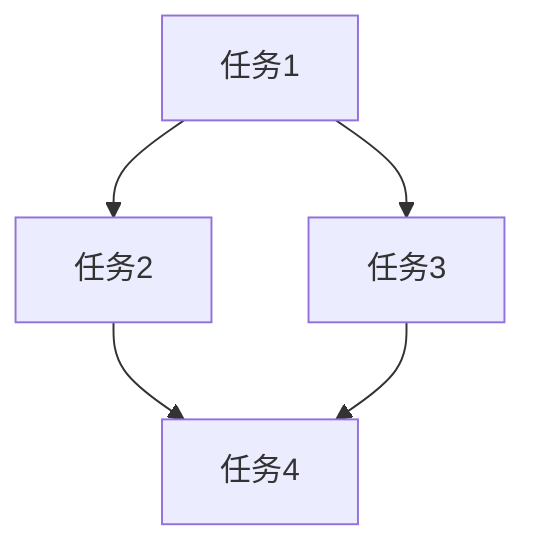

# Dashboard Update Rules - 仪表板更新规则

## 更新时机

### 必须更新 DASHBOARD.md
1. **任务开始时**
   - 记录任务目标
   - 设置初始状态
   - 记录开始时间

2. **生成任务 DAG 后**
   - 更新 DAG 可视化
   - 列出所有子任务
   - 标注依赖关系

3. **子任务状态变更时**
   - 更新任务状态（pending → in_progress → completed）
   - 记录完成时间
   - 记录产出物

4. **验证结果出来时**
   - 更新测试结果
   - 记录通过/失败数
   - 列出失败原因（如有）

5. **审查完成时**
   - 更新审查状态
   - 记录审查意见
   - 列出待处理问题

6. **任务结束时**
   - 更新最终状态
   - 记录总耗时
   - 记录资源消耗

## 更新内容

### Session Info 区域
```markdown
## 📊 Session Info
| 属性 | 值 |
|------|-----|
| Session ID | {uuid} |
| 开始时间 | {timestamp} |
| 当前状态 | {状态} |
| 目标 | {任务目标} |
```

### DAG 可视化区域
使用 Mermaid 语法：
```markdown
## 🗂️ Task DAG

```

### Agent Status 区域
```markdown
## 🤖 Agent Status
| Agent | 状态 | 当前任务 | 完成数 |
|-------|------|----------|--------|
| supervisor | 🟢 Active | 协调任务 | 2 |
| repo-scout | 🔵 Idle | - | 1 |
| implementer | 🟡 Working | 实现功能 | 0 |
```

### Task List 区域
```markdown
## 📋 Task List
| ID | 任务 | 状态 | 执行者 | 时间 |
|----|------|------|--------|------|
| T1 | 分析代码 | ✅ Done | repo-scout | 2min |
| T2 | 设计方案 | ✅ Done | architect | 3min |
| T3 | 实现代码 | 🔄 Running | implementer | - |
| T4 | 运行测试 | ⏳ Pending | tester | - |
```

### Verification 区域
```markdown
## ✅ Verification
| 检查项 | 状态 | 详情 |
|--------|------|------|
| Lint | ✅ Pass | 0 errors, 2 warnings |
| TypeCheck | ✅ Pass | - |
| Unit Tests | 🔄 Running | 45/50 passed |
| Build | ⏳ Pending | - |
```

### Activity Log 区域
```markdown
## 📝 Activity Log
| 时间 | 事件 | 详情 |
|------|------|------|
| 10:30:00 | 任务开始 | 收到用户请求 |
| 10:30:15 | DAG 生成 | 5 个子任务 |
| 10:31:00 | T1 完成 | 找到相关文件 |
```

## 状态图标

| 图标 | 含义 |
|------|------|
| ⏳ | Pending |
| 🔄 | Running |
| ✅ | Completed |
| ❌ | Failed |
| ⚠️ | Warning |
| 🛑 | Blocked |
| 🔵 | Idle |
| 🟢 | Active |
| 🟡 | Working |

