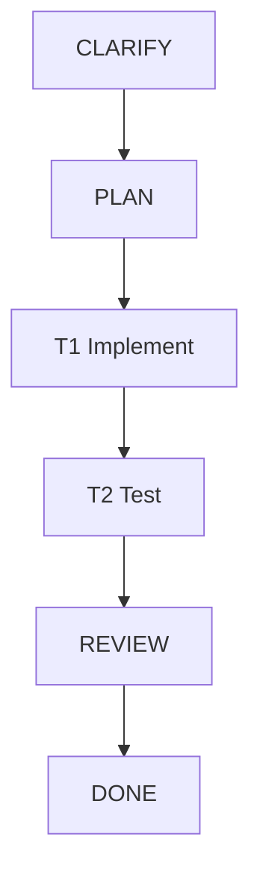

# Multi-Agent SWE Dashboard

> **Human Summary**: {一句话当前状态摘要，例如：正在执行 T2（Implementer），等待产出 `index.ts`}

---

## Status Overview（10 秒可读）

| Attribute | Value |
|-----------|-------|
| **Goal** | {任务目标} |
| **Status** | {IDLE / RUNNING / BLOCKED / COMPLETED} |
| **Phase** | {CLARIFY / PLAN / EXECUTE / VERIFY / REVIEW / DONE} |
| **Next Actions (Top 3)** | {下一步行动（最多 3 条）} |
| **Blockers** | {当前阻塞点 或 None} |
| **Last Updated** | {timestamp} |

---

## Acceptance Criteria & Evidence（验收标准与证据链）

> 规则：只要你写“完成/已修复/可用”，就必须在这里把 AC 标记为 ✅ 并提供 Evidence（可追溯）。

| ID | 验收标准 (AC) | 状态 | Evidence IDs | 证据摘要 |
|----|--------------|------|-------------|---------|
| AC1 | {标准1} | ⏳ / ✅ / ❌ | EV-001 | {例如：`npm test` 通过} |
| AC2 | {标准2} | ⏳ / ✅ / ❌ | EV-002 | {例如：日志/截图/链接} |

### Evidence Index（证据索引）

| Evidence ID | Type | Path / Reference | Notes |
|-------------|------|------------------|-------|
| EV-001 | test | `.claude/state/evidence/EV-001.txt` | {测试命令与输出摘要} |
| EV-002 | doc  | `.claude/state/evidence/EV-002.md`  | {设计/决策说明} |

---

## Task DAG & Progress（任务图与进度）

### Task List（Nodes）
| ID | Task Name | Agent | Status | Risk | Deps | Artifacts | Verify |
|----|-----------|-------|--------|------|------|----------|--------|
| T1 | {实现...} | Implementer | PENDING/RUNNING/DONE/BLOCKED | Low/Med/High | - | {paths} | {how} |

---

## Risk Register & Approvals（风险与审批）

### Risks
| ID | Risk | Level | Mitigation | Approval Required | Approved (Approval ID) |
|----|------|-------|------------|-------------------|------------------------|
| R1 | {风险描述} | Low/Med/High | {缓解措施} | Yes/No | {Yes APP-001 / No} |

### Approvals（高风险变更审批）
| Approval ID | Scope | Requested By | Approved By | Time | Rationale |
|-------------|-------|--------------|-------------|------|-----------|
| APP-001 | {例如：升级依赖 major 版本} | {agent} | {human} | {timestamp} | {原因} |

---

## Quality Gates（质量门）

> 质量门必须可执行、可复现：写清楚 “跑了什么命令 / 结果是什么 / 证据在哪”。

### Pre-commit
- Status: {PENDING/RUNNING/PASS/FAIL/SKIPPED}
- Commands:
  - `{lint_command}` → {PASS/FAIL} (EV-xxx)
  - `{unit_test_command}` → {PASS/FAIL} (EV-xxx)

### Pre-merge
- Status: {PENDING/RUNNING/PASS/FAIL/SKIPPED}
- Checks:
  - Integration Test → {PASS/FAIL} (EV-xxx)
  - Code Review → {PASS/FAIL} (EV-xxx)
  - Security Scan → {PASS/FAIL} (EV-xxx)

---

## Resource Usage（资源消耗）

| Resource | Used | Limit | Status |
|----------|------|-------|--------|
| **Tokens** | 0 | 500k | 🟢 |
| **Tools** | 0 | 100 | 🟢 |

---

## Recent Events（Last 5）

| Time | Type | Actor | Ref | Summary | Evidence |
|------|------|-------|-----|---------|----------|
| - | - | - | - | - | - |

> Full logs: `.claude/state/logs/`

---

Updated by Main Agent | {timestamp}
