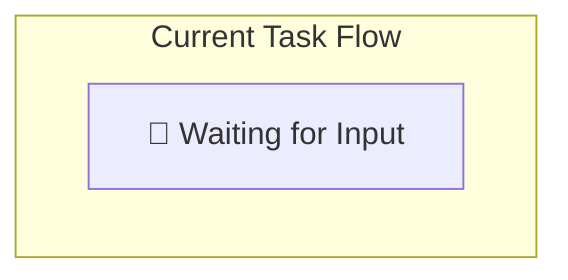

# 🎯 Multi-Agent SWE Dashboard

> **Human Summary**: {一句话当前状态摘要，例如：正在执行 T2 节点，等待 Implementer 产出}

---

## 🚦 Status Overview

| Attribute | Value |
|-----------|-------|
| **Goal** | {任务目标} |
| **Phase** | 🔵 **IDLE** |
| **Next Action** | {下一步行动} |
| **Blockers** | {当前阻塞点 或 None} |

---

## 🎯 Acceptance Criteria & Evidence

> 需求治理与证据链

| ID | 验收标准 (AC) | 状态 | 验证证据 (Evidence) |
|----|-------------|------|-------------------|
| AC1 | {标准1} | ⏳ | - |
| AC2 | {标准2} | ⏳ | - |

---

## 🗂️ Task DAG & Progress

### Task List
| ID | Task Name | Agent | Status | Artifacts |
|----|-----------|-------|--------|-----------|
| - | - | - | - | - |

---

## 🛡️ Risk Register & Quality Gates

### Risks
| Risk | Level | Mitigation | Approved? |
|------|-------|------------|-----------|
| - | - | - | - |

### Quality Gates
- [ ] **Pre-commit**: Lint ✅ | Unit Test ✅
- [ ] **Pre-merge**: Integration Test ✅ | Code Review ✅ | Security Scan ✅

---

## 📈 Resource Usage

| Resource | Used | Limit | Status |
|----------|------|-------|--------|
| **Tokens** | 0 | 500k | 🟢 |
| **Tools** | 0 | 100 | 🟢 |

---

## 📝 Recent Events (Last 5)

| Time | Type | Summary |
|------|------|---------|
| - | - | - |

> *Full logs are saved in `.claude/state/logs/`*

---

Updated by Main Agent | {timestamp}
