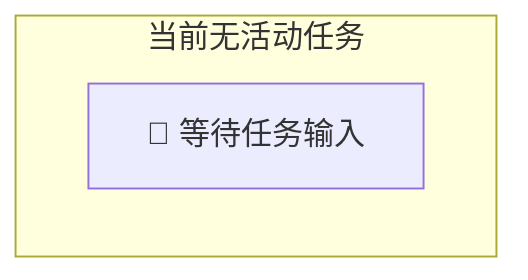
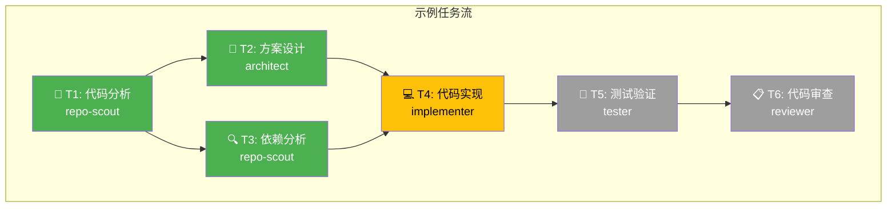

# 🎯 Multi-Agent SWE Dashboard

> 实时展示多智能体软件工程工作流的状态、进度和结果

---

## 📊 Session Info

| 属性 | 值 |
|------|-----|
| **Session ID** | `session-{待初始化}` |
| **开始时间** | - |
| **当前状态** | 🔵 **IDLE** - 等待任务 |
| **目标** | - |
| **当前阶段** | - |

### 状态说明
| 状态 | 含义 |
|------|------|
| 🔵 IDLE | 空闲，等待任务 |
| 🟡 PLANNING | 规划中，生成任务 DAG |
| 🟢 EXECUTING | 执行中 |
| 🔍 VERIFYING | 验证中 |
| 📋 REVIEWING | 审查中 |
| ✅ COMPLETED | 已完成 |
| ❌ FAILED | 失败 |
| 🛑 BLOCKED | 阻塞，需人工介入 |

---

## 🗂️ Task DAG

> 任务依赖关系图（使用 Mermaid 渲染）



### 任务 DAG 模板

当有活动任务时，DAG 将显示如下结构：



**图例**：🟢 已完成 | 🟡 进行中 | ⚪ 待执行 | 🔴 失败 | ⏸️ 阻塞

---

## 🤖 Agent Status

| Agent | 状态 | 当前任务 | 已完成 | Token 消耗 |
|-------|------|----------|--------|------------|
| **Supervisor** | 🔵 Idle | - | 0 | 0 |
| **Repo Scout** | 🔵 Idle | - | 0 | 0 |
| **Architect** | 🔵 Idle | - | 0 | 0 |
| **Implementer** | 🔵 Idle | - | 0 | 0 |
| **Tester** | 🔵 Idle | - | 0 | 0 |
| **Reviewer** | 🔵 Idle | - | 0 | 0 |

### Agent 说明

| Agent | 职责 | 主要产出 |
|-------|------|----------|
| Supervisor | 任务协调、DAG 生成、质量门控 | 任务计划、状态报告 |
| Repo Scout | 代码检索、依赖分析 | 搜索报告、影响分析 |
| Architect | 技术方案、接口设计 | ADR、设计文档 |
| Implementer | 代码实现、Bug 修复 | Patch、测试代码 |
| Tester | 测试执行、结果分析 | 测试报告、覆盖率 |
| Reviewer | 代码审查、安全检查 | 审查报告、问题清单 |

---

## 📋 Task List

| ID | 任务名称 | 类型 | 执行者 | 状态 | 耗时 | 产出 |
|----|----------|------|--------|------|------|------|
| - | *暂无任务* | - | - | - | - | - |

### 状态图标说明
- ⏳ **Pending** - 等待执行
- 🔄 **Running** - 正在执行
- ✅ **Done** - 已完成
- ❌ **Failed** - 失败
- 🛑 **Blocked** - 阻塞
- ⏭️ **Skipped** - 跳过

---

## ✅ Verification Status

| 检查项 | 状态 | 详情 | 最后运行 |
|--------|------|------|----------|
| **Lint** | ⏳ Pending | - | - |
| **TypeCheck** | ⏳ Pending | - | - |
| **Unit Tests** | ⏳ Pending | - | - |
| **Integration Tests** | ⏳ Pending | - | - |
| **Build** | ⏳ Pending | - | - |

### 测试统计

| 指标 | 值 |
|------|-----|
| 总测试数 | - |
| 通过 | - |
| 失败 | - |
| 跳过 | - |
| 覆盖率 | - |

---

## 📈 Resource Usage

| 资源 | 已用 | 预算 | 百分比 |
|------|------|------|--------|
| **Token** | 0 | 500,000 | 0% |
| **工具调用** | 0 | 100 | 0% |
| **运行时间** | 0s | 30min | 0% |

### 资源预警阈值
- 🟢 < 50%: 正常
- 🟡 50-80%: 警告
- 🔴 > 80%: 危险

---

## 📝 Activity Log

| 时间 | 事件类型 | Agent | 详情 |
|------|----------|-------|------|
| - | *暂无活动* | - | - |

### 事件类型
- 📥 **INPUT** - 接收输入
- 🎯 **PLAN** - 生成计划
- 🔧 **EXECUTE** - 执行任务
- ✅ **COMPLETE** - 完成任务
- ❌ **ERROR** - 错误
- ⚠️ **WARNING** - 警告
- 🔄 **RETRY** - 重试
- 🛑 **BLOCK** - 阻塞

---

## 🚨 Issues & Warnings

### 当前问题
| 严重程度 | 问题 | 位置 | 状态 |
|----------|------|------|------|
| - | *暂无问题* | - | - |

### 历史问题
*暂无历史问题记录*

---

## 📦 Artifacts

> 本次会话产生的产出物

### 代码变更
| 文件 | 操作 | 行数变更 |
|------|------|----------|
| - | *暂无变更* | - |

### 文档更新
| 文件 | 类型 |
|------|------|
| - | *暂无更新* |

### 测试添加
| 文件 | 测试数 |
|------|--------|
| - | *暂无添加* |

---

## 📊 Session Summary

> 会话结束时自动生成

```yaml
session_summary:
  id: "待生成"
  duration: "-"
  status: "idle"
  
  tasks:
    total: 0
    completed: 0
    failed: 0
  
  code_changes:
    files_modified: 0
    lines_added: 0
    lines_removed: 0
  
  verification:
    tests_run: 0
    tests_passed: 0
    coverage: "-"
  
  resources:
    tokens_used: 0
    tool_calls: 0
```

---

## 🔗 Quick Links

- [CLAUDE.md](./CLAUDE.md) - 项目记忆与规范
- [.claude/agents/](./.claude/agents/) - 子智能体定义
- [.claude/skills/](./.claude/skills/) - 技能定义
- [.claude/rules/](./.claude/rules/) - 规则定义
- [.claude/commands/](./.claude/commands/) - 自定义命令

---

<sub>Dashboard 自动更新 by Multi-Agent SWE Framework | 最后更新: {自动生成}</sub>

