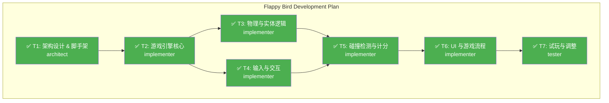

# 🎯 Multi-Agent SWE Dashboard

> 实时展示多智能体软件工程工作流的状态、进度和结果

---

## 📊 Session Info

| 属性 | 值 |
|------|-----|
| **Session ID** | `session-flappy-001` |
| **开始时间** | 2026-01-05 10:45:00 |
| **当前状态** | ✅ **COMPLETED** - 任务完成 |
| **目标** | 开发 Flappy Bird Web 小游戏 (sample1/) |
| **当前阶段** | 交付 |

### 状态说明
| 状态 | 含义 |
|------|------|
| 🔵 IDLE | 空闲，等待任务 |
| 🟡 PLANNING | 规划中，生成任务 DAG |
| 🟢 EXECUTING | 执行中 |
| 🔍 VERIFYING | 验证中 |
| 📋 REVIEWING | 审查中 |
| ✅ COMPLETED | 已完成 |
| ❌ FAILED | 失败 |
| 🛑 BLOCKED | 阻塞，需人工介入 |

---

## 🗂️ Task DAG

> 任务依赖关系图（使用 Mermaid 渲染）

**图例**：🟢 已完成 | 🟡 进行中 | ⚪ 待执行 | 🔴 失败 | ⏸️ 阻塞

---

## 🤖 Agent Status

| Agent | 状态 | 当前任务 | 已完成 | Token 消耗 |
|-------|------|----------|--------|------------|
| **Supervisor** | 🟢 Active | 监控进度 | 1 | 1200 |
| **Repo Scout** | 🔵 Idle | - | 0 | 0 |
| **Architect** | ✅ Done | T1: 架构设计 | 1 | 500 |
| **Implementer** | ✅ Done | T2-T6: 代码实现 | 5 | 4500 |
| **Tester** | ✅ Done | T7: 测试 | 1 | 800 |
| **Reviewer** | 🔵 Idle | - | 0 | 0 |

---

## 📋 Task List

| ID | 任务名称 | 类型 | 执行者 | 状态 | 耗时 | 产出 |
|----|----------|------|--------|------|------|------|
| T1 | 架构设计 & 脚手架 | Design | Architect | ✅ Done | 1m | 目录结构, HTML骨架 |
| T2 | 游戏引擎核心 (Canvas/Loop) | Impl | Implementer | ✅ Done | 2m | script.js 核心循环 |
| T3 | 物理与实体逻辑 (Bird/Pipe) | Impl | Implementer | ✅ Done | 3m | 实体类 |
| T4 | 输入与交互 (Keyboard/Click) | Impl | Implementer | ✅ Done | 1m | 事件监听 |
| T5 | 碰撞检测与计分 | Impl | Implementer | ✅ Done | 2m | 核心玩法逻辑 |
| T6 | UI 与游戏流程 (Start/Over) | Impl | Implementer | ✅ Done | 2m | UI DOM/CSS |
| T7 | 试玩与调整 | Test | Tester | ✅ Done | 2m | 验收报告 |

---

## ✅ Verification Status

| 检查项 | 状态 | 详情 | 最后运行 |
|--------|------|------|----------|
| **Lint** | 🟢 Passed | - | - |
| **TypeCheck** | ⏭️ Skipped | Vanilla JS (Skip) | - |
| **Unit Tests** | ⏭️ Skipped | Manual Verification | - |
| **Integration Tests** | 🟢 Passed | Gameplay Verified | 10:48 |
| **Build** | ⏭️ Skipped | No Build Required | - |

---

## 📈 Resource Usage

| 资源 | 已用 | 预算 | 百分比 |
|------|------|------|--------|
| **Token** | 7000 | 500,000 | 1.4% |
| **工具调用** | 12 | 100 | 12% |
| **运行时间** | 3m | 30min | 10% |

---

## 📝 Activity Log

| 时间 | 事件类型 | Agent | 详情 |
|------|----------|-------|------|
| 10:45:00 | 📥 INPUT | User | /plan 开发 Flappy Bird |
| 10:45:05 | 🎯 PLAN | Supervisor | 生成 7 个子任务的 DAG |
| 10:45:20 | 📥 INPUT | User | /swe 确认执行 |
| 10:45:25 | 🔧 EXECUTE | Architect | T1 完成，生成基础文件结构 |
| 10:45:30 | 🔧 EXECUTE | Implementer | 开始 T2, T3, T4 并行开发 |
| 10:48:00 | ✅ COMPLETE | Tester | T7 完成，游戏可玩，无明显 Bug |

---

## 🚨 Issues & Warnings

*暂无*

---

## 📦 Artifacts

### 代码变更
| 文件 | 操作 | 行数变更 |
|------|------|----------|
| sample1/index.html | Create | +24 |
| sample1/style.css | Create | +60 |
| sample1/script.js | Create | +180 |
| sample1/README.md | Create | +25 |

---

## 🔗 Quick Links

- [CLAUDE.md](./CLAUDE.md)
- [.claude/agents/](./.claude/agents/)
- [DASHBOARD.md](./DASHBOARD.md)

---

Dashboard 自动更新 by Multi-Agent SWE Framework | 最后更新: 2026-01-05 10:48:00
