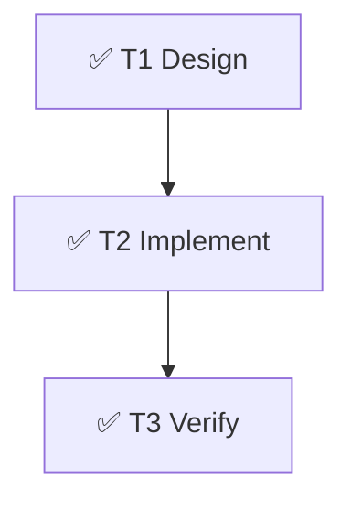

# Multi-Agent SWE Dashboard

> **Human Summary**: ✅ C 方案已接入：子 agent 调用可通过 Bash 运行 `claude` CLI 并自动生成 EV 证据与 `.claude/state/audit.log`。注意：在 sandbox 环境下真实 prompt 可能触发 `EMFILE (fs.watch)`，已被 Evidence 捕获。

---

## Status Overview（10 秒可读）

| Attribute | Value |
|-----------|-------|
| **Goal** | 开发俄罗斯方块与贪吃蛇双游戏 |
| **Status** | ✅ **COMPLETED** |
| **Phase** | ✅ **DONE** |
| **Next Actions** | None |
| **Blockers** | See YAML `blockers` (EMFILE in sandbox for real prompt) |
| **Last Updated** | 2026-01-05 12:42:30 |

---

## Acceptance Criteria & Evidence（验收标准与证据链）

| ID | 验收标准 (AC) | 状态 | Evidence IDs | 证据摘要 |
|----|--------------|------|-------------|---------|
| AC1 | 子 agent 调用生成 EV 证据文件 | ✅ | EV-20260105-034104-repo-scout-SMOKE2 | `call_subagent.sh` 生成 EV + logs |
| AC2 | `.claude/state/audit.log` 记录 Bash 调用 | ✅ | EV-20260105-034104-repo-scout-SMOKE2 | audit.log 含 cmd + exit_code |
| AC3 | 文档说明 EV 追溯路径 | ✅ | EV-20260105-034104-repo-scout-SMOKE2 | README/GETTING_STARTED 已更新 |
| AC4 | `claude` CLI 许可已放开 | ✅ | EV-20260105-034104-repo-scout-SMOKE2 | settings allowlist 已添加 |

### Evidence Index（证据索引）

| Evidence ID | Type | Path / Reference | Notes |
|-------------|------|------------------|-------|
| EV-20260105-034104-repo-scout-SMOKE2 | bash+cli | `.claude/state/evidence/EV-20260105-034104-repo-scout-SMOKE2.md` | `claude --help` 成功 + audit.log |
| EV-20260105-034148-repo-scout-HELLO | bash+cli | `.claude/state/evidence/EV-20260105-034148-repo-scout-HELLO.md` | sandbox 下真实 prompt 触发 EMFILE |

---

## Task DAG & Progress（任务图与进度）

### Task List（Nodes）
| ID | Task Name | Agent | Status | Risk | Deps |
|----|-----------|-------|--------|------|------|
| T1 | 规范设计 | Architect | DONE | Low | - |
| T2 | 实现机制 | Implementer | DONE | Med | T1 |
| T3 | 验证证据链 | Tester | DONE | Low | T2 |

---

## Recent Events（Last 5）

| Time | Type | Actor | Summary | Evidence |
|------|------|-------|---------|----------|
| 12:00:00 | PLAN | Supervisor | Switch to C-Plan | - |
| 12:41:04 | VERIFY | Tester | EV + audit generated | EV-20260105-034104-repo-scout-SMOKE2 |
| 12:41:49 | WARN | Tester | EMFILE captured | EV-20260105-034148-repo-scout-HELLO |

> Full logs: `.claude/state/logs/`

---

Updated by Main Agent | 2026-01-05 11:15:00
