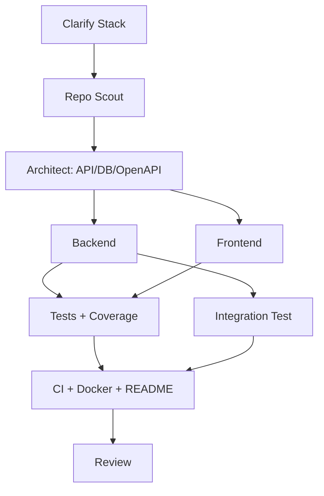

# Multi-Agent SWE Dashboard

> **Human Summary**: 已生成“轻量级任务管理系统”开发计划与 DAG。下一步需要你确认技术栈（React/Vue、Express/Flask、SQLite/PostgreSQL）以及是否启用拖拽排序（可选）。鉴权/JWT 属于安全敏感实现，执行前建议走一次 `/approve`。

---

## Status Overview（10 秒可读）

| Attribute | Value |
|-----------|-------|
| **Goal** | 轻量级任务管理系统（JWT 用户/项目/任务/过滤搜索/UI/API/OpenAPI/测试/CI/Docker） |
| **Status** | RUNNING |
| **Phase** | PLAN |
| **Next Actions (Top 3)** | 确认技术栈与是否拖拽；确认鉴权是否需要 `/approve` |
| **Blockers** | None |
| **Last Updated** | 2026-01-05 04:27:44 |

---

## Acceptance Criteria & Evidence（验收标准与证据链）

> 规则：只要你写“完成/已修复/可用”，就必须在这里把 AC 标记为 ✅ 并提供 Evidence（可追溯）。

| ID | 验收标准 (AC) | 状态 | Evidence IDs | 证据摘要 |
|----|--------------|------|-------------|---------|
| AC1 | 用户管理 + JWT | ⏳ | - | 注册/登录/退出 + 修改昵称/邮箱 |
| AC2 | 项目分组 + 归档 | ⏳ | - | 项目下包含任务 |
| AC3 | 任务 CRUD + 优先级/截止/状态 | ⏳ | - | 高/中/低；完成切换 |
| AC4 | 搜索与过滤 | ⏳ | - | 关键字 + 过滤器 |
| AC5 | 前端 UI | ⏳ | - | 任务视图 + 项目视图 |
| AC6 | API + OpenAPI | ⏳ | - | Swagger 文档可访问 |
| AC7 | 测试与覆盖率 | ⏳ | - | 单测≥70% + 集成测试 |
| AC8 | README + Docker + CI | ⏳ | - | GHA + Dockerfile |

### Evidence Index（证据索引）

| Evidence ID | Type | Path / Reference | Notes |
|-------------|------|------------------|-------|
| EV-001 | test | `.claude/state/evidence/EV-001.txt` | {测试命令与输出摘要} |
| EV-002 | doc  | `.claude/state/evidence/EV-002.md`  | {设计/决策说明} |

---

## Task DAG & Progress（任务图与进度）

### Task List（Nodes）
| ID | Task Name | Agent | Status | Risk | Deps | Artifacts | Verify |
|----|-----------|-------|--------|------|------|----------|--------|
| T1 | Clarify Stack | Supervisor | PENDING | Low | - | DASHBOARD.md | Confirm stack/drag&drop/approve |
| T2 | Repo Scout | repo-scout | PENDING | Low | T1 | search-report.md | Report w/ file refs |
| T3 | API/DB/OpenAPI | architect | PENDING | Med | T2 | docs/api/openapi.yaml | Spec review |
| T4 | Backend | implementer | PENDING | High | T3 | backend/ | Run CRUD/auth |
| T5 | Frontend | implementer | PENDING | Med | T3 | frontend/ | UI renders |
| T6 | Unit Tests | tester | PENDING | Med | T4,T5 | coverage report | >=70% |
| T7 | Integration Test | tester | PENDING | Med | T4 | tests/integration/ | passes |
| T8 | CI+Docker+Docs | implementer | PENDING | Med | T6,T7 | Dockerfile+GHA | CI green |
| T9 | Review | reviewer | PENDING | Low | T8 | review-report.md | no blockers |

---

## Risk Register & Approvals（风险与审批）

### Risks
| ID | Risk | Level | Mitigation | Approval Required | Approved (Approval ID) |
|----|------|-------|------------|-------------------|------------------------|
| R1 | {风险描述} | Low/Med/High | {缓解措施} | Yes/No | {Yes APP-001 / No} |

### Approvals（高风险变更审批）
| Approval ID | Scope | Requested By | Approved By | Time | Rationale |
|-------------|-------|--------------|-------------|------|-----------|
| APP-001 | {例如：升级依赖 major 版本} | {agent} | {human} | 2026-01-05 04:18:17 | {原因} |

---

## Quality Gates（质量门）

> 质量门必须可执行、可复现：写清楚 “跑了什么命令 / 结果是什么 / 证据在哪”。

### Pre-commit
- Status: {PENDING/RUNNING/PASS/FAIL/SKIPPED}
- Commands:
  - `{lint_command}` → {PASS/FAIL} (EV-xxx)
  - `{unit_test_command}` → {PASS/FAIL} (EV-xxx)

### Pre-merge
- Status: {PENDING/RUNNING/PASS/FAIL/SKIPPED}
- Checks:
  - Integration Test → {PASS/FAIL} (EV-xxx)
  - Code Review → {PASS/FAIL} (EV-xxx)
  - Security Scan → {PASS/FAIL} (EV-xxx)

---

## Resource Usage（资源消耗）

| Resource | Used | Limit | Status |
|----------|------|-------|--------|
| **Tokens** | 0 | 500k | 🟢 |
| **Tools** | 0 | 100 | 🟢 |

---

## Recent Events（Last 5）

| Time | Type | Actor | Ref | Summary | Evidence |
|------|------|-------|-----|---------|----------|
| - | - | - | - | - | - |

> Full logs: `.claude/state/logs/`

---

Updated by Main Agent | 2026-01-05 04:18:17
