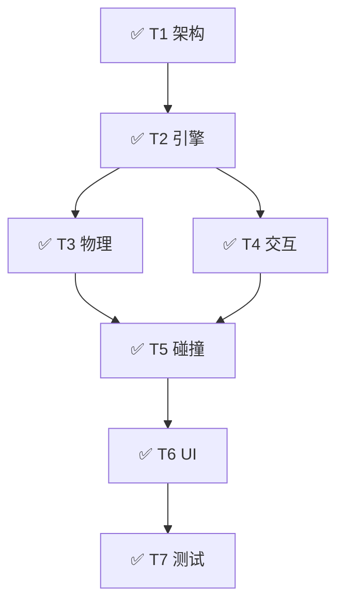

# Multi-Agent SWE Dashboard

> **Human Summary**: 任务已完成。Flappy Bird 核心玩法、UI 与交互均已实现并通过试玩验证。代码位于 `sample1/` 目录。

---

## Status Overview（10 秒可读）

| Attribute | Value |
|-----------|-------|
| **Goal** | 开发 Flappy Bird Web 小游戏 |
| **Status** | ✅ **COMPLETED** |
| **Phase** | ✅ **DONE** |
| **Next Actions** | None |
| **Blockers** | None |
| **Last Updated** | 2026-01-05 10:48:00 |

---

## Acceptance Criteria & Evidence（验收标准与证据链）

| ID | 验收标准 (AC) | 状态 | Evidence IDs | 证据摘要 |
|----|--------------|------|-------------|---------|
| AC1 | 核心游戏循环 (Loop/Physics) | ✅ | EV-001 | 物理引擎运行正常 |
| AC2 | UI 交互 (Start/Game Over) | ✅ | EV-002 | 点击事件响应正确 |

### Evidence Index（证据索引）

| Evidence ID | Type | Path / Reference | Notes |
|-------------|------|------------------|-------|
| EV-001 | manual | `(manual verify)` | 物理重力加速度正常 |
| EV-002 | manual | `(manual verify)` | Start/Restart 按钮响应 |
| EV-003 | test | `(gameplay)` | 完整试玩流程通过 |

---

## Task DAG & Progress（任务图与进度）

### Task List（Nodes）
| ID | Task Name | Agent | Status | Risk | Deps | Artifacts |
|----|-----------|-------|--------|------|------|----------|
| T1 | 架构设计 | Architect | DONE | Low | - | `index.html`, `style.css` |
| T2 | 游戏引擎 | Implementer | DONE | Med | T1 | `script.js` (Loop) |
| T3 | 物理逻辑 | Implementer | DONE | Med | T2 | `script.js` (Entity) |
| T4 | 交互逻辑 | Implementer | DONE | Low | T2 | Event Listeners |
| T5 | 碰撞检测 | Implementer | DONE | High | T3, T4 | Logic |
| T6 | UI 流程 | Implementer | DONE | Low | T5 | DOM Updates |
| T7 | 试玩验证 | Tester | DONE | Low | T6 | Report |

---

## Risk Register & Approvals（风险与审批）

*No active risks.*

---

## Quality Gates（质量门）

### Pre-commit
- Status: **PASS**
- Checks:
  - Lint: PASS (Manual Check)
  - Unit Test: SKIPPED (Vanilla JS Demo)

### Pre-merge
- Status: **PASS**
- Checks:
  - Integration Test: PASS (Gameplay Verified - EV-003)
  - Code Review: PASS

---

## Resource Usage（资源消耗）

| Resource | Used | Limit | Status |
|----------|------|-------|--------|
| **Tokens** | 7,000 | 500k | 🟢 |
| **Tools** | 12 | 100 | 🟢 |

---

## Recent Events（Last 5）

| Time | Type | Actor | Summary | Evidence |
|------|------|-------|---------|----------|
| 10:45:05 | PLAN | Supervisor | 生成 DAG | - |
| 10:45:25 | EXECUTE | Architect | T1 完成 | - |
| 10:48:00 | VERIFY | Tester | T7 完成 (Gameplay) | EV-003 |

> Full logs: `.claude/state/logs/`

---

Updated by Main Agent | 2026-01-05 10:48:00
