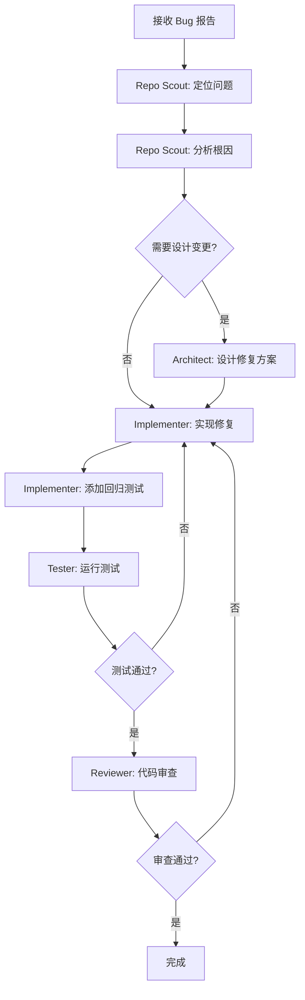
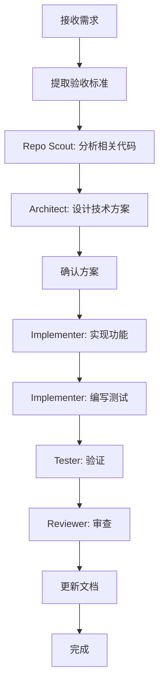

# 🏗️ Multi-Agent SWE Framework - 架构设计文档

> 本文档详细描述多智能体软件工程框架的架构设计、设计理念和工程哲学。

---

## 目录

1. [项目概述](#项目概述)
2. [设计理念](#设计理念)
3. [系统架构](#系统架构)
4. [核心组件](#核心组件)
5. [工作流设计](#工作流设计)
6. [智能体设计](#智能体设计)
7. [记忆系统](#记忆系统)
8. [质量保证](#质量保证)
9. [扩展性设计](#扩展性设计)
10. [最佳实践](#最佳实践)

---

## 项目概述

### 背景

随着大语言模型（LLM）能力的提升，AI 辅助编程从简单的代码补全演进到能够理解复杂需求、规划实现方案、自主编写和测试代码的阶段。然而，单一 Agent 模式面临以下挑战：

1. **上下文限制**：单一上下文窗口难以容纳大型代码库的全部信息
2. **专注度下降**：同时处理分析、设计、实现、测试等多种任务时效果下降
3. **可控性不足**：复杂任务的中间状态难以追踪和干预
4. **可验证性弱**：难以结构化地验证每个步骤的产出

### 解决方案

本框架采用 **多智能体协作** 模式：

- **Cursor** 作为主 Agent，负责用户交互和高层协调
- **Claude Code Subagents** 作为子智能体，各自专注特定领域
- **结构化协议** 确保智能体间的有效协作
- **DAG 任务建模** 支持复杂任务的分解和并行执行
- **实时 Dashboard** 提供任务进度的可视化监控

### 目标用户

- 希望提升 AI 辅助编程效率的开发者
- 需要可审计、可追溯开发流程的团队
- 探索多智能体协作模式的研究者

---

## 设计理念

### 1. 控制面与数据面分离

> 源自 DR Agent 论文的核心架构思想

**控制面（Control Plane）**负责"决定做什么"：
- 任务分解与 DAG 生成
- 智能体调度与资源分配
- 状态转换与质量门控
- 异常处理与回滚策略

**数据面（Data Plane）**负责"执行具体操作"：
- 代码检索与分析
- 工具链执行（测试、lint、build）
- 代码生成与修改
- 结果收集与报告

这种分离带来：
- **清晰的职责边界**：控制逻辑不与执行逻辑混杂
- **更好的可测试性**：可以独立测试调度逻辑和执行逻辑
- **灵活的扩展性**：添加新工具不影响控制逻辑

### 2. 结构化优于自然语言

智能体之间的通信采用结构化格式（YAML/JSON），而非纯自然语言：

```yaml
# 好的做法：结构化任务描述
task:
  id: "T1"
  type: "implement"
  description: "添加用户邮箱验证"
  context:
    files: ["src/services/UserService.ts"]
    constraints: ["不修改现有接口"]
  expected_output:
    format: "patch"
```

```text
# 避免：纯自然语言
"请帮我在 UserService.ts 里添加邮箱验证功能，
注意不要改现有接口，完成后给我看看改了什么。"
```

结构化的好处：
- **无歧义**：字段定义明确，减少误解
- **可验证**：输出可以自动校验格式
- **可追溯**：便于日志记录和回放
- **可组合**：便于程序化处理和聚合

### 3. 外显的工作流状态

将工作流状态从 Agent 的内部记忆中外显到可观测的 Dashboard：

- **状态机可视化**：当前处于哪个阶段，下一步是什么
- **DAG 进度图**：哪些任务完成了，哪些在执行
- **智能体状态**：每个 Agent 在做什么
- **资源消耗**：Token 用量、时间消耗

这实现了：
- **人机协作**：用户可以随时了解进度、干预方向
- **调试友好**：出问题时能定位到具体步骤
- **可复现**：相同输入 + 相同状态 = 相同输出

### 4. 质量内建而非后补

将质量保证嵌入工作流的每个阶段，而非作为最后的补丁：

```
代码变更 → [Lint] → [TypeCheck] → [Test] → [Review] → 产出
           ↑         ↑            ↑        ↑
           失败自动回滚到上一阶段
```

两个质量门：
- **Pre-commit Gate**：快速验证（秒级），阻止明显问题
- **Pre-merge Gate**：完整验证（分钟级），确保生产就绪

### 5. 最小权限原则

默认情况下，智能体只能执行安全操作：

| 权限级别 | 操作示例 | 默认策略 |
|----------|----------|----------|
| 读取 | 文件读取、代码搜索 | 允许 |
| 本地写入 | 修改文件、运行测试 | 询问/允许 |
| 影响外部 | git push、部署 | 禁止/需审批 |

---

## 系统架构

### 整体架构图

```
┌─────────────────────────────────────────────────────────────────┐
│                        User Interface                            │
│                         (Cursor IDE)                             │
└─────────────────────────────┬───────────────────────────────────┘
                              │
                              ▼
┌─────────────────────────────────────────────────────────────────┐
│                     Main Agent (Cursor)                          │
│  ┌─────────────────────────────────────────────────────────┐    │
│  │                   Control Plane                          │    │
│  │  ┌──────────┐  ┌──────────┐  ┌──────────┐  ┌─────────┐ │    │
│  │  │ Task     │  │ DAG      │  │ State    │  │ Quality │ │    │
│  │  │ Parser   │  │ Planner  │  │ Machine  │  │ Gate    │ │    │
│  │  └──────────┘  └──────────┘  └──────────┘  └─────────┘ │    │
│  └─────────────────────────────────────────────────────────┘    │
└─────────────────────────────┬───────────────────────────────────┘
                              │
          ┌───────────────────┼───────────────────┐
          │                   │                   │
          ▼                   ▼                   ▼
┌─────────────────┐ ┌─────────────────┐ ┌─────────────────┐
│   Subagent 1    │ │   Subagent 2    │ │   Subagent N    │
│  (Repo Scout)   │ │  (Implementer)  │ │    (Tester)     │
│  ┌───────────┐  │ │  ┌───────────┐  │ │  ┌───────────┐  │
│  │   Data    │  │ │  │   Data    │  │ │  │   Data    │  │
│  │   Plane   │  │ │  │   Plane   │  │ │  │   Plane   │  │
│  └───────────┘  │ │  └───────────┘  │ │  └───────────┘  │
└─────────────────┘ └─────────────────┘ └─────────────────┘
          │                   │                   │
          └───────────────────┼───────────────────┘
                              │
                              ▼
┌─────────────────────────────────────────────────────────────────┐
│                      Shared Resources                            │
│  ┌──────────┐  ┌──────────┐  ┌──────────┐  ┌──────────────┐    │
│  │ Codebase │  │  Tools   │  │ Dashboard│  │ Audit Log    │    │
│  │  (Git)   │  │ (Test,   │  │ (State)  │  │ (History)    │    │
│  │          │  │  Lint..) │  │          │  │              │    │
│  └──────────┘  └──────────┘  └──────────┘  └──────────────┘    │
└─────────────────────────────────────────────────────────────────┘
```

### 数据流

```
1. 用户输入任务
       │
       ▼
2. Main Agent 解析任务，生成 DAG
       │
       ▼
3. 按 DAG 顺序调度 Subagents
       │
       ├──► Subagent 执行 ──► 返回结果
       │         │
       │         ▼
       │    更新 Dashboard
       │
       ▼
4. 质量门检查
       │
       ├── Pass ──► 继续下一步
       │
       └── Fail ──► 回滚/重试
       │
       ▼
5. 最终产出（PR/Patch/Report）
```

---

## 核心组件

### 1. 配置系统 (.claude/settings.json)

管理权限、hooks 和全局设置：

```json
{
  "permissions": {
    "allow": ["Read(*)", "Grep(*)"],
    "ask": ["Write(*)", "Edit(*)"],
    "deny": ["Bash(git push*)"]
  },
  "hooks": {
    "PreToolExecution": {
      "Bash": { "command": "echo ... >> audit.log" }
    }
  },
  "budget": {
    "maxTokensPerSession": 500000,
    "maxToolCallsPerTask": 100
  }
}
```

### 2. 智能体定义 (.claude/agents/*.md)

每个智能体是一个带 YAML frontmatter 的 Markdown 文件：

```markdown
---
name: implementer
description: 代码实现者
tools: Read, Write, Edit, Grep
model: sonnet
permissionMode: acceptEdits
skills: code-implementation
---

# Implementer Agent

你是一个专业的软件开发工程师...
```

### 3. 技能系统 (.claude/skills/*/SKILL.md)

可复用的能力模块，智能体可以按需加载：

```markdown
---
name: dag-planning
description: DAG 任务建模技能
allowed-tools: Read, Grep
---

# DAG Planning Skill

## 任务分解原则
...
```

### 4. 规则系统 (.claude/rules/*.md)

全局或路径限定的行为规则：

```markdown
---
paths: ["**/*.ts", "**/*.js"]
alwaysApply: true
---

# Code Quality Rules

## TypeScript 规则
- 避免使用 any
- 启用 strict 模式
...
```

### 5. 命令系统 (.claude/commands/*.md)

可复用的工作流封装：

```markdown
---
allowed-tools: Read, Write, Bash
description: 执行完整 SWE 流程
---

# /swe 命令

执行一个完整的软件工程任务...
```

### 6. Dashboard (DASHBOARD.md)

实时状态展示：

- Session 信息
- DAG 可视化（Mermaid）
- Agent 状态表
- 任务列表
- 验证状态
- 活动日志
- 资源消耗

---

## 工作流设计

### 状态机

```
INIT → PLANNING → EXECUTING → VERIFYING → REVIEWING → COMPLETED
                      ↑           │           │
                      └───────────┴───────────┘
                           (失败回滚)
```

### 典型任务流程

#### Bug 修复流程



#### 新功能流程



### 失败处理策略

| 阶段 | 失败类型 | 处理策略 |
|------|----------|----------|
| 分析 | 找不到相关代码 | 扩大搜索范围 |
| 设计 | 方案不可行 | 尝试替代方案 |
| 实现 | 语法错误 | 自动修复 |
| 测试 | 测试失败 | 分析 → 修复 → 重试 |
| 审查 | 审查不通过 | 按意见修改 |

重试上限：3 次
超限处理：标记阻塞，请求人工介入

---

## 智能体设计

### 设计原则

1. **单一职责**：每个智能体专注一个领域
2. **明确契约**：输入/输出格式明确定义
3. **最小权限**：只给必要的工具访问
4. **可组合**：智能体之间可以灵活组合

### 智能体角色

| 智能体 | 职责 | 核心能力 | 主要产出 |
|--------|------|----------|----------|
| Supervisor | 协调控制 | DAG 规划、调度、门控 | 任务计划、状态报告 |
| Repo Scout | 代码侦察 | 搜索、分析、追踪 | 搜索报告、影响分析 |
| Architect | 方案设计 | 设计、评估、权衡 | ADR、接口定义 |
| Implementer | 代码实现 | 编码、测试、变更管理 | Patch、测试代码 |
| Tester | 测试验证 | 执行、分析、报告 | 测试报告、覆盖率 |
| Reviewer | 代码审查 | 审查、检查、验收 | 审查报告、问题清单 |

### 智能体协作模式

#### 1. 串行协作
```
Scout → Architect → Implementer → Tester → Reviewer
```
适用于：需求明确、变更范围小

#### 2. 并行协作
```
Scout ─┬→ Implementer (模块A)
       └→ Implementer (模块B)  → Tester → Reviewer
```
适用于：无依赖的多模块变更

#### 3. 迭代协作
```
Implementer ⟷ Tester (循环直到测试通过)
```
适用于：需要多轮调试的复杂变更

---

## 记忆系统

### 记忆层级

| 层级 | 位置 | 作用域 | 生命周期 |
|------|------|--------|----------|
| 企业级 | `/Library/Application Support/ClaudeCode/CLAUDE.md` | 组织 | 持久 |
| 用户级 | `~/.claude/CLAUDE.md` | 用户 | 持久 |
| 项目级 | `./CLAUDE.md` | 项目 | 持久 |
| 本地级 | `./CLAUDE.local.md` | 个人+项目 | 持久 |
| 会话级 | Dashboard + State | 会话 | 临时 |

### 记忆内容

**持久记忆（CLAUDE.md）**：
- 项目约定和规范
- 智能体协作协议
- 常用命令说明
- 安全规则

**会话记忆（Dashboard）**：
- 当前任务状态
- DAG 执行进度
- 智能体状态
- 验证结果

### 上下文工程

**原则**：每个智能体只接收它需要的上下文

```yaml
# 好的做法：精简上下文
context:
  task: "修复 UserService.validateEmail 的空指针"
  relevant_code: |
    // 只包含相关函数
    function validateEmail(email: string) { ... }
  error_log: |
    TypeError: Cannot read property 'match' of null
```

```yaml
# 避免：过载上下文
context:
  entire_codebase: "..."  # 几十万行代码
  all_commit_history: "..." # 几千条记录
```

---

## 质量保证

### 质量门

#### Pre-commit Gate（快速验证）

| 检查项 | 工具 | 阈值 |
|--------|------|------|
| Lint | ESLint/Ruff | 0 errors |
| TypeCheck | TSC/mypy | 0 errors |
| 格式 | Prettier/Black | 自动修复 |
| 单元测试 | Jest/Pytest | 100% pass |

执行时间目标：< 2 分钟

#### Pre-merge Gate（完整验证）

| 检查项 | 工具 | 阈值 |
|--------|------|------|
| 全量测试 | CI | 100% pass |
| 覆盖率 | NYC/Coverage | >= 80% |
| 安全扫描 | npm audit | 0 critical |
| 构建 | Build | Success |

执行时间目标：< 15 分钟

### 审查清单

```markdown
## 必须检查
- [ ] 功能正确性
- [ ] 边界条件处理
- [ ] 错误处理
- [ ] 安全性

## 建议检查
- [ ] 代码可读性
- [ ] 性能影响
- [ ] 测试充分性
- [ ] 文档更新
```

### 回归预防

1. **自动添加回归测试**：修复 Bug 时必须添加覆盖该场景的测试
2. **变更影响分析**：评估变更对其他模块的影响
3. **持续集成**：每次提交都运行测试

---

## 扩展性设计

### 添加新智能体

1. 在 `.claude/agents/` 创建新的 `.md` 文件
2. 定义 frontmatter（name, tools, model）
3. 编写 system prompt
4. 在 Supervisor 中注册调用路径

### 添加新技能

1. 在 `.claude/skills/` 创建新目录
2. 创建 `SKILL.md` 定义技能
3. 在智能体的 frontmatter 中引用技能

### 添加新命令

1. 在 `.claude/commands/` 创建新的 `.md` 文件
2. 定义 frontmatter（allowed-tools, description）
3. 编写命令说明

### 集成新工具

1. 在 `settings.json` 的 permissions 中添加工具
2. 在相关智能体的 frontmatter 中添加工具
3. 在技能文档中说明使用方法

---

## 最佳实践

### 任务描述

```yaml
# 好的任务描述
task:
  goal: "修复用户登录时的空指针异常"
  context:
    error: "TypeError: Cannot read property 'email' of null"
    location: "src/auth/LoginService.ts:42"
  acceptance_criteria:
    - "用户输入为空时显示友好错误"
    - "添加回归测试覆盖此场景"
```

### DAG 设计

```yaml
# 好的 DAG 设计
dag:
  - id: T1
    name: "定位问题"
    dependencies: []
  - id: T2
    name: "分析根因"
    dependencies: [T1]
  - id: T3
    name: "设计方案"
    dependencies: [T2]
  - id: T4
    name: "实现修复"
    dependencies: [T3]
  - id: T5
    name: "添加测试"
    dependencies: [T3]  # 与 T4 并行
  - id: T6
    name: "验证"
    dependencies: [T4, T5]
```

### 错误处理

```yaml
# 失败时的标准处理流程
on_failure:
  1. 记录错误到日志
  2. 分析失败原因
  3. 判断是否可重试
  4. 重试或请求人工介入
  5. 更新 Dashboard 状态
```

### 资源管理

```yaml
# 资源预算分配
budget:
  analysis: 20%   # 代码分析
  design: 10%     # 方案设计
  implement: 40%  # 代码实现
  verify: 20%     # 测试验证
  review: 10%     # 代码审查
```

---

## 总结

本框架通过以下设计实现高效、可控、可扩展的多智能体软件工程：

1. **控制面/数据面分离**：清晰的职责边界
2. **结构化通信**：减少歧义，便于验证
3. **外显状态**：实时监控，便于干预
4. **质量内建**：两级质量门，失败自动回滚
5. **最小权限**：安全第一，风险操作需审批
6. **模块化设计**：易于扩展和定制

---

<sub>Multi-Agent SWE Framework Architecture v1.0.0 | 2026-01-04</sub>

