# 🚀 Getting Started - 快速开始指南

> 本指南帮助你快速上手 Multi-Agent SWE Framework。

---

## 前置条件

### 必需
- **Cursor IDE**：最新版本
- **Claude Code**：已安装并配置
- **Git**：用于版本控制

### 推荐
- Node.js 18+ 或 Python 3.10+（取决于项目）
- 对应的测试框架（Jest/Pytest 等）

---

## 安装步骤

### 1. 克隆或复制框架

将框架文件复制到你的项目根目录：

```
your-project/
├── CLAUDE.md           # 复制
├── DASHBOARD.md        # 复制
└── .claude/            # 复制整个目录
    ├── settings.json
    ├── agents/
    ├── skills/
    ├── rules/
    ├── commands/
    └── state/
```

### 2. 根据项目调整配置

编辑 `.claude/settings.json`，根据你的项目调整：

```json
{
  "permissions": {
    "allow": [
      "Read(*)",
      "Grep(*)",
      // 添加你的测试命令
      "Bash(npm test*)",  // 或 "Bash(pytest*)"
      "Bash(npm run lint*)"
    ]
  }
}
```

### 3. 更新 CLAUDE.md

根据你的项目更新主记忆文件：

- 项目特定的代码规范
- 项目的目录结构说明
- 特殊的工作流要求

### 4. 验证安装

在 Cursor 中打开项目，尝试使用命令：

```
/status
```

如果能看到 Dashboard 内容，说明安装成功。

---

## 基本使用

### 查看状态

```
/status
```

显示当前的 Dashboard 信息。

### 执行任务

#### 简单任务

直接描述你的需求：

```
帮我修复 UserService 中的空指针异常
```

#### 复杂任务（推荐使用命令）

```
/swe 实现用户邮箱验证功能，包括：1. 前端表单验证 2. 后端格式检查 3. 发送验证邮件
```

### 分析代码

```
/analyze src/services/AuthService.ts
```

分析指定文件或模块的结构和依赖。

### 生成计划

```
/plan 重构支付模块，提高可测试性
```

生成任务 DAG，但不立即执行。

### 运行测试

```
/test src/auth/
```

运行指定范围的测试。

### 代码审查

```
/review
```

对当前变更进行代码审查。

### 退出框架模式

```
/exit
```

退出当前框架模式，Agent 将停止维护 Dashboard，仅作为普通 AI 助手响应。

### 通过 Bash + Claude Code CLI 调用子 agent（可追溯证据链）

> 目标：让“是否真的通过终端调用子 agent”变成可验证事实（命令 + 输出 + exit code）。

1. 确保已安装 Claude Code CLI：

```bash
claude --version
```

2. 用包装器调用子 agent（会自动生成 Evidence）：

```bash
.claude/bin/call_subagent.sh implementer T1 prompts/T1.md
```

3. 查看证据文件与审计日志：
- `.claude/state/evidence/<EV_ID>.md`
- `.claude/state/logs/<EV_ID>.out.txt` / `.err.txt` / `.cmd.txt`
- `.claude/state/audit.log`

---

## 工作流示例

### 示例 1: Bug 修复

**输入**:
```
/swe 修复用户登录时输入为空导致的崩溃

错误信息：TypeError: Cannot read property 'trim' of undefined
位置：src/auth/login.ts:42
```

**框架执行流程**:

1. **Supervisor** 接收任务，生成 DAG
2. **Repo Scout** 定位问题代码，分析调用链
3. **Implementer** 实现修复 + 添加防御性检查
4. **Tester** 运行测试确认修复
5. **Reviewer** 代码审查
6. **更新 Dashboard** 记录完成

**产出**:
- 代码修复 patch
- 回归测试
- 审查报告

### 示例 2: 新功能

**输入**:
```
/swe 添加用户头像上传功能

要求：
- 支持 jpg/png 格式
- 限制 2MB 以内
- 保存到 uploads/ 目录
```

**框架执行流程**:

1. **Supervisor** 生成任务 DAG（5 个子任务）
2. **Repo Scout** 分析现有文件上传代码
3. **Architect** 设计 API 和存储方案
4. **Implementer** 实现上传接口
5. **Implementer** 编写测试（并行）
6. **Tester** 验证功能
7. **Reviewer** 审查代码
8. **更新文档**

### 示例 3: 重构

**输入**:
```
/plan 将 AuthService 从单例模式改为依赖注入

目标：提高可测试性，便于 mock
约束：不改变公开 API
```

**框架执行**:

1. 生成详细计划（不立即执行）
2. 等待用户确认
3. 确认后按计划执行

---

## Dashboard 解读

Dashboard 采用“双层结构”设计：顶部 YAML 为机器状态，下方 Markdown 为人类视图。

### 1. Machine Snapshot (YAML)

这是 Agent 状态的权威来源：

```yaml
session_info:
  status: "RUNNING" # 运行状态
  phase: "EXECUTE"  # 当前阶段
  next_actions:     # 下一步明确指令
    - { agent: "Implementer", action: "修复边界条件" }

dag:
  nodes: # 任务节点与状态
    - { id: "T1", status: "DONE", artifacts: ["src/utils.ts"] }
```

### 2. Status Overview (Human View)

为人类设计的快速概览表格（10秒可读）：

| Attribute | Value |
|-----------|-------|
| **Goal** | 修复登录空指针异常 |
| **Status** | 🟢 RUNNING |
| **Phase** | 🔧 EXECUTE |
| **Next Actions** | Implementer: 修复边界条件 |

### 3. Task DAG & Progress

可视化任务依赖图：

```mermaid
graph TD
  T1[✅ 定位问题] --> T2[✅ 分析根因]
  T2 --> T3[🔄 实现修复]
  T3 --> T4[⏳ 运行测试]
```



---

## 常见问题

### Q: 任务执行时间太长怎么办？

A: 检查 Dashboard 的资源消耗部分，如果接近预算上限，可能需要：
1. 简化任务范围
2. 调整 `settings.json` 中的预算
3. 手动干预中间步骤

### Q: 测试一直失败怎么办？

A: 查看 Dashboard 的验证状态部分：
1. 检查失败原因
2. 如果是 flaky test，标记跳过
3. 如果是代码问题，检查 Implementer 的输出

### Q: 如何干预正在执行的任务？

A: 直接输入新指令，框架会：
1. 记录当前状态
2. 暂停或调整计划
3. 按新指令继续

### Q: 如何添加项目特定的规则？

A: 创建 `.claude/rules/my-project.md`:

```markdown
---
paths: ["src/**"]
alwaysApply: true
---

# My Project Rules

- 使用 spaces 而非 tabs
- 变量名使用 camelCase
- ...
```

---

## 下一步

- 阅读 [ARCHITECTURE.md](./ARCHITECTURE.md) 了解框架设计
- 查看 [.claude/agents/](./.claude/agents/) 了解各智能体
- 尝试修改配置，定制你的工作流

---

<sub>Multi-Agent SWE Framework | Getting Started Guide v1.0.0</sub>

